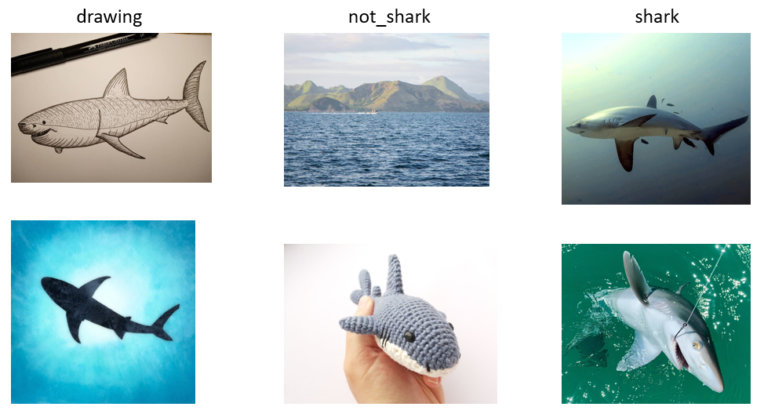

# Shark-classification-model
Composed of convolutional nueral networks, deep & transfer learning, VGG16 pre-trained model, Keras, and Tensorflow backend

## Introduction
Abundance and distribution data of global shark populations is necessary for effective conservation and management. Direct methods such as surveys and fisheries monitoring are adequate, however they rarely provide species specific indices of population abundance. Yet, there is a plethora of unstructured data that is virtually untapped and can fill this informational gap. Instagram contains over a billion users worldwide and despite the vast amounts of shark images available, there is little research that implements social medias like Instagram for shark conservation. By using this image classification model trained to identify sharks, we can generate inferred shark sightings. Our approach creates abundance and distribution maps that suggest Instagram can be efficiently exploited to reveal spatiotemporal trends in shark populations. Using alternative sources of abundance data is needed for management and conservation of these important data-poor group of marine animals. 
Note -- (This model works best when predicting images originating from Instagram, but is also effective with predicting images from other repositories)

In early trainings, we identified challenges in a binary classification structure that more often than not, pointed to drawings of sharks. After adding a 'drawing' class and increasing the threshold to 0.63, this model can predict shark images with 92% accuracy.

In conjuncture with Instagram web scraping utilizing InstaCrawlR [3] for post collection, this model can be used in a pipeline which maps inferred shark sightings according to predictions and locations mentioned in the post [1]. You can find this repository [here.](https://github.com/JeremyFJ/Instagram_sharkSighting)



Image examples for the three classes: drawing, not_shark, and shark

## Data
You can download the image repository [here.](https://drive.google.com/drive/folders/1ov4wfJUWTLWmqwUbvs8v0L9BUCZed6E4?usp=sharing)

The dataset structure is shown below
```
    ├── dataset                   <- root
        ├── training_set          <- training set folders
        |   ├── drawing        <- image files
        |   ├── not_shark           
        |   ├── shark
        |  
        ├── test_set              <- validation set folders
        |   ├── drawing        <- image files
        |   ├── not_shark           
        |   ├── shark
``` 
## Code
This model implements the Keras package with a Tensorflow backend entirely in Python. The pre-trained VGG16 is a CNN model built by Zisserman and Simonyan from the University of Oxford that achieves 92.7% accuracy from ImageNet with 14 million images and 1000 classes [4]. The final layer is explicitly written in this code after specifying 'include_top=False'. The final layers are frozen to better train the model to identify shark features. 

### Requires
- [Anaconda / Python 3.7.3](https://www.anaconda.com/products/individual)
- [Tensorflow 2.2.0](https://www.tensorflow.org/)
- [Keras 2.3.1](https://keras.io/)
- [sklearn 0.21.2](https://scikit-learn.org/stable/)
- [PIL 6.1.0](https://pillow.readthedocs.io/en/stable/)

## Run
To run training:
```
python main_train.py
```
Note -- Keep the image directory names static (or make changes to `img_loader.py`)
(1) This script will load images from 7 different directories using csv files listing image designations. These designations specify either training or test set and which class the image is suited for. You can change the configurations within the csv files. 
(2) For fluency, it is easy to add images into the training model once they have been validated. Simply add the images to their designated directories and a list of the files to the csv. 
(3) Once predictions are made on the test set, accuracy and training history is reported in addition to confusion matrix plots for each class.
(4) To view the mistakes during validation, `class_prediction.csv` and `prediction_probability.csv` are generated. You can edit `move_file.py` to identify false negative and false positive labels.

To run prediction:
```
python main_inference.py
```
Note -- Add the images you want predicted to `model_predictor/dataset/test_set/shark/` 
(1) Training weights saved as `.h5` are loaded for predictions as well as preprocessed data saved as `.npy` files.
(2) You can adjust the threshold however you want. It is currently set to 0.63.
(3) `class_prediction.csv` is produced and again, `move_file.py` can be run to identify shark and non-shark predictions. You can edit `main_inference.py` to identify drawing predictions as well. 

## Results


## References
- [1] Jenrette J, Liu ZY-C, Hastie T, Ferretti F. Data mining Instagram for tracking global sharkpopulations. Science Advances (TBD). 2020.
- [2] Liu ZY-C, Chamberlin AJ, Shome P, Jones IJ, Riveau G, Jouanard N, Ndione, Sokolow SH, De Leo GA. Identification of snails and parasites of medical importance via convolutional neural network: an application for human schistosomiasis. PLoS neglected tropical diseases. 2019.
- [3] Schroeder J. InstaCrawlR. Crawl public Instagram data using R scripts without API access token. 2018. 
- [4] Zisserman A, Simonyan K. Very Deep Convolutional Networks for Large-Scale Image Recognition. Published in arXiv. 2014.

## Contact
- Data: jjeremy1@vt.edu
- Model: jjeremy1@vt.edu, zacycliu@stanford.edu
